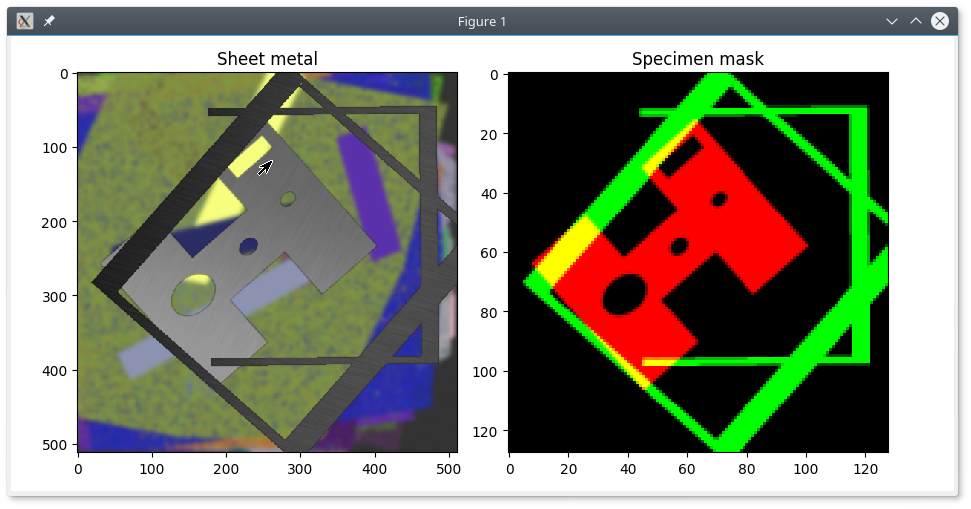

# FeaturedMind #

This project is meant to be a workbench for experiments with deep learning based image segmentation setups. 

## Description ##

The main purpose is to create a model which is able to detect various features in a high resolution image:

* A specimen which should be scanned, for instance a sheet metal part.
* A fixture which might be in the optical path between scanner and specimen.

This is a proof-of-concept showing that a task like this is possible with reasonable loss and especially recall. 
If working it might be possible to measure real life setups with fixture parts blocking a scanning sensor and decide which parts of the scanned image has to be masked to get a meaningful polygonization nevertheless.

*Please note:*

* This project is entirely private and has been done in free time. It's not (yet ?) related to my employer.
* Because of the real life background images from scanning machines being confidential, the workbench can create artificial background images with just some noisy rectangles for demonstration purposes.

So this is a generated image on the left and the expected outcome (two masks in different channels). The generared image uses noisy rectangles instead of the read training background images:

The outcome varies, depending on the background image type and, of course, the training parameters. In the demonstration setup with noisy rectangles as image background, the edge detection is quite accurate:

")

## Current state ##

Current I'm getting quite impressive results when retraining a pre-trained object detection network like VGG16 or InceptionV3. I'm experimenting with various parameters and model setups to learn more about the possibilities here.
